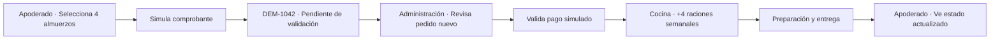

# Wireframes funcionales — Gate 2

> **Corrección aprobada para Gate 3:** las referencias históricas de este documento a comprobante, transferencia, validación o confirmación individual se reemplazan por `pasarela genérica ficticia → pago aprobado → confirmación y sincronización automáticas con Cocina`. Administración supervisa y gestiona excepciones. Después de `Listo para entrega`, Cocina incorpora `Simular lectura de QR → Confirmar entrega`. QR es solo un ejemplo: ticket impreso, búsqueda manual, listados y el flujo vigente del casino son configurables. La especificación normativa actual es `demo-ux-spec.md`.

Estos wireframes son deliberadamente de baja fidelidad. Validan jerarquía, contenido, continuidad y responsive; la apariencia final se define durante construcción usando el sistema aprobado en G1.

## Mapa conectado



## Shell común — escritorio

```text
┌─────────────────────────────────────────────────────────────────────────────┐
│ EnBandeja  Colegio Modelo EnBandeja  [Demo · datos ficticios]              │
│            [Apoderado] [Administración] [Cocina]   Ayuda  Reiniciar  Volver│
├─────────────────────────────────────────────────────────────────────────────┤
│ Aviso: esta operación es ficticia; no genera cobros ni guarda datos reales.│
├─────────────────────────────────────────────────────────────────────────────┤
│ CONTENIDO PRINCIPAL DEL ROL                                                   │
└─────────────────────────────────────────────────────────────────────────────┘
```

## Shell común — móvil

```text
┌───────────────────────────────┐
│ EnBandeja          [Demo] [⋯] │
│ Colegio Modelo EnBandeja      │
│ [Apoderado][Admin][Cocina]    │
├───────────────────────────────┤
│ Operación ficticia · sin cobro│
├───────────────────────────────┤
│ CONTENIDO EN UNA COLUMNA      │
└───────────────────────────────┘
```

## Apoderado — Menú semanal

### Escritorio

```text
┌────────────────────────────────────────────────────────────────────────────┐
│ Menú semanal                                       Estudiante Demo 01      │
│ Selecciona una alternativa por día.                3° Básico B             │
├────────────────────────────────────────────┬───────────────────────────────┤
│ Lunes 3                                   │ Tu selección                  │
│ (●) Pollo al horno                         │ Lunes · Menú del día          │
│ ( ) Pastel de choclo vegetal               │ Martes · Vegetariano          │
│ ( ) Pasta con salsa                        │ Jueves · Menú del día         │
│                                            │ Viernes · Especial            │
│ Martes 4                                  │                               │
│ ( ) Albóndigas de pavo                     │ 4 almuerzos                   │
│ (●) Croquetas de lentejas                  │ Total demo $16.800            │
│ ...                                        │ [Revisar pedido]              │
└────────────────────────────────────────────┴───────────────────────────────┘
```

### Móvil

```text
┌───────────────────────────────┐
│ Menú semanal                  │
│ Estudiante Demo 01 · 3° B     │
├───────────────────────────────┤
│ Lunes 3                       │
│ (●) Menú del día              │
│ ( ) Vegetariano               │
│ ( ) Alternativa especial      │
│ ( ) No solicitar              │
├───────────────────────────────┤
│ Martes 4 ...                  │
├───────────────────────────────┤
│ 4 almuerzos · $16.800 demo    │
│ [Revisar pedido]              │
└───────────────────────────────┘
```

## Apoderado — Confirmación

```text
┌──────────────────────────────────────────────────────────────┐
│ ✓ Pedido DEM-1042 creado                                    │
│ Estado: Pendiente de validación                              │
│                                                              │
│ El pedido ya está visible en Administración.                 │
│ Ninguna acción generó un cobro real.                         │
│                                                              │
│ [Verlo en Administración]   Quiero una revisión para mi casino│
└──────────────────────────────────────────────────────────────┘
```

## Administración — Pedidos

### Escritorio

```text
┌─────────────────────────────────────────────────────────────────────────────┐
│ Pedidos de la semana                                                        │
│ [Buscar pedido...] [Estado: Todos ▾] [Curso: Todos ▾]                       │
├──────────┬────────────────────┬──────────┬──────────┬────────────┬──────────┤
│ Pedido   │ Perfil             │ Curso    │ Raciones │ Estado     │ Acción   │
├──────────┼────────────────────┼──────────┼──────────┼────────────┼──────────┤
│ DEM-1042 │ Estudiante Demo 01 │ 3° B     │ 4        │ Pendiente  │ [Revisar]│
│ DEM-1041 │ Estudiante Demo 12 │ 6° A     │ 5        │ Sincronizado│ [Ver]   │
│ ...      │                    │          │          │            │          │
└──────────┴────────────────────┴──────────┴──────────┴────────────┴──────────┘
```

### Móvil

```text
┌───────────────────────────────┐
│ Pedidos                       │
│ [Buscar] [Filtros]            │
├───────────────────────────────┤
│ NUEVO · DEM-1042              │
│ Estudiante Demo 01 · 3° B     │
│ 4 raciones · $16.800 demo     │
│ Pendiente de validación       │
│ [Revisar pedido]              │
└───────────────────────────────┘
```

## Administración — Detalle y validación

```text
┌───────────────────────────────────────────┬───────────────────────────────┐
│ DEM-1042 · Pendiente de validación        │ Historial                     │
│ Estudiante Demo 01 · 3° Básico B          │ ✓ Pedido creado               │
│ 4 raciones · $16.800 demo                 │ ✓ Comprobante simulado        │
│                                            │ ○ Esperando validación         │
│ comprobante-demo.pdf [DATO FICTICIO]      │                               │
│                                            │ Impacto: +4 raciones en Cocina│
│ [Validar pago simulado] [Marcar revisión] │                               │
└───────────────────────────────────────────┴───────────────────────────────┘
```

## Cocina — Producción

### Escritorio

```text
┌────────────────────────────────────────────────────────────────────────────┐
│ Producción de hoy · Actualizado desde Administración                      │
│ 37 raciones validadas                                                      │
├──────────────────────┬──────────────────────┬──────────────────────────────┤
│ Menú del día · 21    │ Vegetariano · 10    │ Alternativa especial · 6     │
├──────────────────────┴──────────────────────┴──────────────────────────────┤
│ [Por menú] [Por curso]                                                     │
│ 3° Básico B · 7 raciones · incluye DEM-1042                               │
│ [Ver detalle operacional]                                                  │
└────────────────────────────────────────────────────────────────────────────┘
```

### Móvil

```text
┌───────────────────────────────┐
│ Producción de hoy             │
│ 37 raciones validadas         │
├───────────────────────────────┤
│ Menú del día            21    │
│ Vegetariano             10    │
│ Alternativa especial     6    │
├───────────────────────────────┤
│ [Por menú] [Por curso]        │
│ 3° B · 7 raciones             │
│ [Ver detalle]                 │
└───────────────────────────────┘
```

## Decisiones que estos wireframes congelan

- La demo abre con elección explícita de rol, pero recomienda empezar como Apoderado.
- No requiere login ni datos del visitante.
- La carga de comprobante se simula; no abre archivos locales.
- Las tablas se transforman en tarjetas en móvil, sin scroll horizontal esencial.
- El resumen de selección no será un footer fijo que tape contenido.
- Cada pantalla tiene una acción primaria y una salida clara.
- El CTA comercial es secundario durante el flujo y cobra protagonismo al completarlo.
